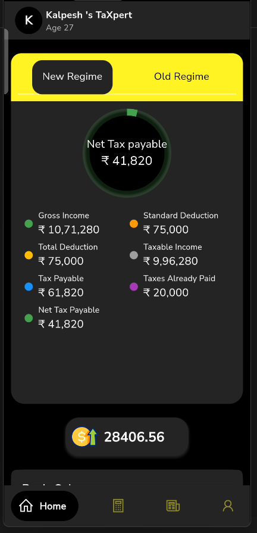
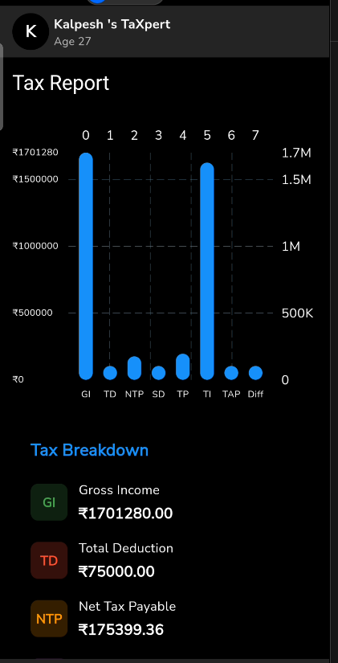
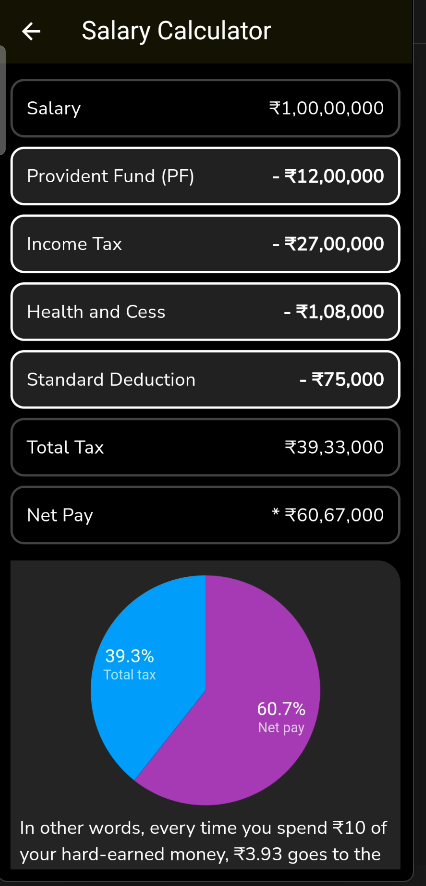

Certainly! Here's an updated README template with sections for adding a video, screenshots, usage, and installation instructions.

---

<h1 align="center" id="title">TaxXpert - Tax Education and Calculator App</h1>

<p align="center"></p>

<p id="description">This Flutter-based mobile application is designed to empower Indian citizens with comprehensive knowledge about government tax schemes and deductions. Many individuals are unaware of the various benefits offered under sections like 80C, 80D, and 80E. This app bridges that knowledge gap by providing a user-friendly interface that helps users understand and calculate their taxes effectively, enabling them to make informed financial decisions.</p>

<h2>🧐 Features</h2>

Here are some of the project's best features:

* **Tax Calculation:** Users can input details about their income sources and deductions to calculate their taxes under both the old and new tax regimes.
* **Comparison:** The app provides a comparison between the old and new tax regimes, highlighting the benefits to the user.
* **Deduction Awareness:** Educates users about various tax deductions (80C, 80D, 80E, etc.).
* **Financial Calculators:** Includes a Salary Breakdown Calculator and a Loan Calculator.
* **Analytics:** Users can view detailed analytics based on their gross income, net payable tax, and other relevant metrics.
* **PDF Sharing:** Enables users to generate and share tax information as PDF documents with CAs and others, facilitating proper tax planning and claiming benefits.

<h2>💻 Built with</h2>

Technologies used in the project:

* **Flutter:** Cross-platform framework for building natively compiled applications.
* **Hive:** Lightweight and fast key-value database for local data storage.
* **Riverpod:** State management solution for Flutter applications.

<h2>📸 Screenshots</h2>

<p align="center">
  
    
  
  
</p>

<h2>🎥 Demo Video</h2>


https://github.com/user-attachments/assets/5d1359ac-69ad-41a6-bea1-4593ba9b4ac6


<p align="center">
https://github.com/user-attachments/assets/42b90097-2f55-4778-9fd9-4db2d5a3a366</p>

<h2>🚀 Installation</h2>

To get started with the project, follow these steps:

1. **Clone the repository:**
    ```bash
    git clone https://github.com/your_username/TaxXpert.git
    ```
2. **Navigate to the project directory:**
    ```bash
    cd TaxXpert
    ```
3. **Install dependencies:**
    ```bash
    flutter pub get
    ```
4. **Run the app:**
    - Connect your device or start an emulator.
    - Use the command:
    ```bash
    flutter run
    ```

<h2>📚 Usage</h2>

1. **Input Details:** Provide information about income sources and eligible deductions.
2. **Calculate Taxes:** Use the app to calculate your taxes under the old and new regimes.
3. **Compare Regimes:** See which tax regime offers better benefits based on your financial information.
4. **Use Financial Tools:** Utilize the Salary Breakdown and Loan Calculator features.
5. **View Analytics:** Access detailed analytics to make informed financial decisions.
6. **Share PDFs:** Generate and share tax information with your CA or others as needed.

<h2>🤝 Contributing</h2>

Contributions are welcome! Please fork the repository and submit a pull request with your enhancements.


